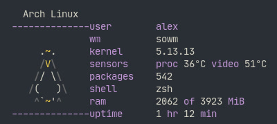

<p align="center">
    
</p>

Minimal system fetch written in pure POSIX sh (Linux only). No external dependencies — everything is read directly from `/proc` and `/sys`.

Shows user, window manager, kernel, CPU/GPU temperatures, package count, shell, RAM usage and uptime. WM detection works on both X11 and Wayland; package counting supports pacman, dpkg, apk, xbps, rpm, portage, slackware, kiss, nix, guix and more.

### Usage

```sh
./hfetch          # print system info
./hfetch -v       # print version
```

### Thanks

[bfetch](https://gitlab.com/nautilor/bfetch)<br />
[mfetch](https://github.com/depsterr/mfetch)<br />
[fet.sh](https://github.com/6gk/fet.sh)<br />
[pfetch](https://github.com/dylanaraps/pfetch)
